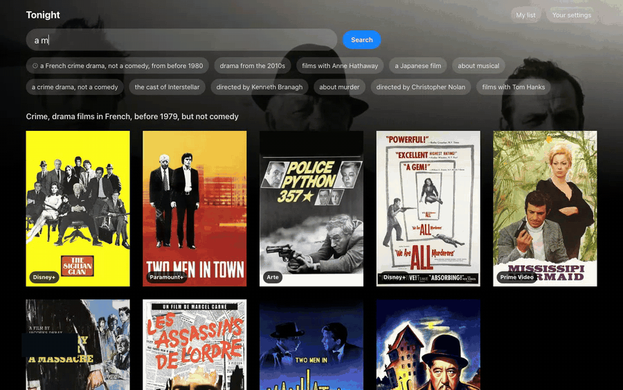
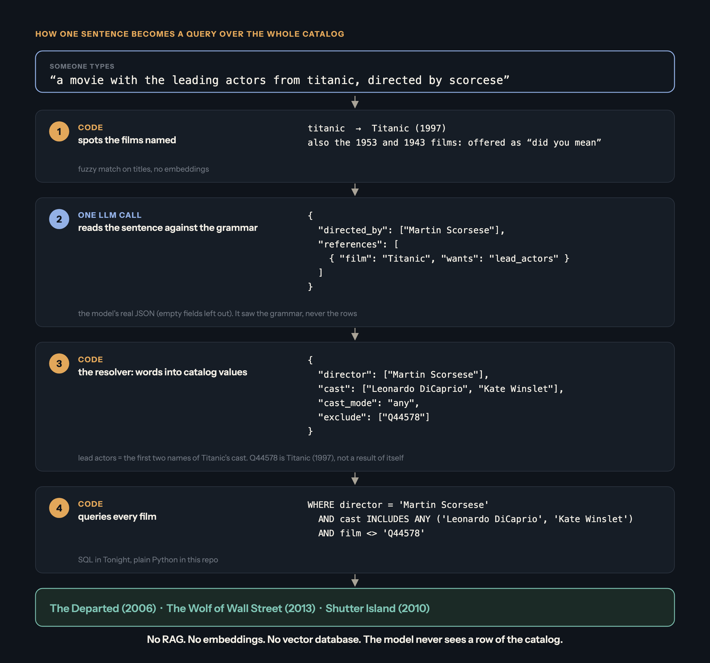
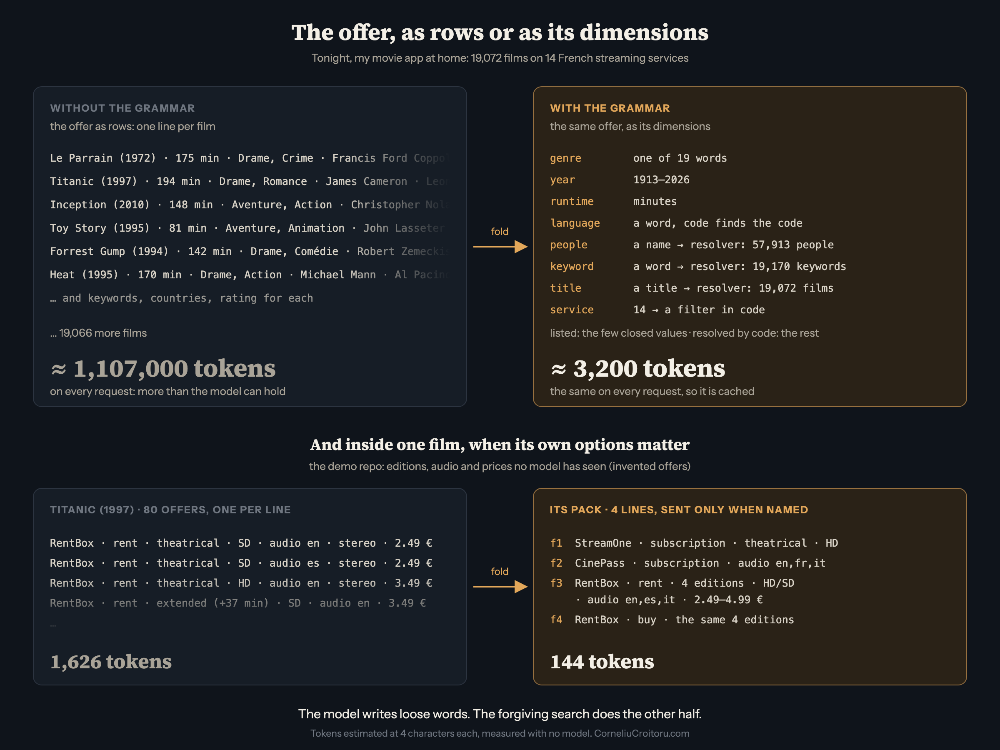

# Natural language search over your whole catalog, without RAG

**Type a sentence, get real results from every row. One small LLM call reads it against a grammar of your catalog, and code runs the query. No embeddings, no vector database, nothing invented.**

Movies are the example here: a movie search over 200 films, with a web demo. The same works for an online shop, hotels, flights. The trick is the search grammar pattern.

The full story, with the diagrams and the numbers: [The Search Grammar Pattern: Natural Language Search with LLMs](https://corneliucroitoru.com/writing/search-grammar-pattern/).



*The web demo in this repo: `python3 -m examples.movies.web`. 200 films, one model call per search, and every step code took, shown under the results.*

The pattern comes from Tonight, my movie app at home, on 19,072 real films: [the full tour on YouTube](https://youtu.be/hoCesxy2o08).

## The problem

At home we pay for several streaming services. I wanted one search across all of them, in plain words:

- "a French crime drama, not a comedy, from before 1980"
- "a movie with the leading actors from titanic, directed by scorcese"
- "a film by the director of Heat"
- "godfathr"

Pulling fields out of the sentence is not enough. "crime drama" is two genres at once. "the director of Heat" is a person nobody named. "scorcese" and "godfathr" are names nobody spelled right. Each needs the system to know the catalog. The model doesn't.

I tried a prompt with tools first. It failed in the same places every time. The model decided when to search and what to call things. It suggested films it knew, not films I had. It said "not available" about films that were. Every fix was one more line in the prompt.

Everything you hand the model, you can only **ask**. Everything you keep in code, you can **guarantee**.

## How it works



**1 · Code spots the films named.** A forgiving search, plain fuzzy matching with no embeddings, finds "titanic" in the sentence and loads what the model needs to know about it. Several matches are never hidden: the others come back as "did you mean".

**2 · One LLM call reads the sentence against the grammar.** The grammar is the offer described by its dimensions instead of its rows: every field a person can mean, plus the few closed values (19 genres). Not the catalog. The model fills the fields as strict JSON. It never searches, never picks an id, never says "I can't".



Measured on Tonight's real data, 19,072 films: about 1.1 million tokens as rows, about 3,200 as a grammar. The same on every request, so it's cached.

**3 · The resolver turns the model's words into catalog values.** The model writes loose words; code finds the real thing and says how sure it is. Without this, the model's words would match nothing.

```
"de nino"     ->  Robert De Niro          close
"godfathr"    ->  The Godfather (1972)    close
"le parrain"  ->  The Godfather (1972)    exact   every title, in every language
```

**4 · Code queries every film.** The filters run over the whole catalog: SQL in Tonight, plain Python here. Then code says back what it did: applied, cannot (with the reason), not found, did you mean. Only code says "can't", because only code knows the data.

## Tonight and this repo

Tonight is the real app: 9 searches in the [full video on YouTube](https://youtu.be/hoCesxy2o08), one model call each, every result checked film by film.

**This repo is not Tonight.** Tonight is private: real catalog, real streaming data, its own interface. This repo rebuilds the engine, with a small web demo, so you can run it and read it in ten minutes:

| | Tonight (the video) | This repo |
|---|---|---|
| Films | 19,072, everything on my 14 services | 200, the most known on Wikipedia, plus 30 French |
| Where to watch | real streaming availability | 17,262 **invented** offers on 8 fictional services |
| What it shows | the grammar and the forgiving search, at full size | the same, plus packs: options each film has that no model has seen |

So the searches from the video will not all work here. Most of those films are simply not in the 200. See [The data](#the-data).

## One step further: packs

In Tonight, a film is on a service or not. Some catalogs go further: every item has its own options. Here, Titanic (1997) has a *Cameron's cut* and an *extended (+37 min)*, on some services, in some languages. No model knows that.

So the repo adds two things to the grammar:

```
DICTIONARY   what every film shares, written once, cached      editions, qualities, languages, modes
PACK         one film's own options, folded into a few lines,  f3 RentBox · rent · Cameron's cut/extended (+37 min)
             sent only when the sentence names the film                   /theatrical · HD/SD · ...
```

The model points into the pack: `film m83, family f3, edition "extended (+37 min)"`. Code finds the real offer, its id and its price. Try "titanic extended cut in french, cheapest" in the demo: "extended cut" becomes the edition only this film has, and code says French audio exists only on another service.

Each field also has a status: `ready` (code applies it), `dictionary` (the model says a neutral fact like "age 6", code decides what it means here), `later` (understood, not possible yet, with the reason). Nothing is dropped silently.

## The data

`data/films.json`: 200 real films from Wikidata (CC0): titles in three forms, year, runtime, directors, the first 8 actors, genres, topics, countries, languages, and the TMDB poster path. Mostly famous American and English-language films from 1990 to 2019, 32 French, one Korean (Parasite), and three films called Titanic on purpose, so a title can be ambiguous.

`data/offers.json`: 17,262 ways to watch them, **invented**: 8 fictional services, buy, rent, subscription or free, editions, HD, 4K or SD, audio and subtitles, prices from 0 to 18.99 €.

With 200 films, a search can be read right and still find little, and code says so ("a Wes Anderson comedy": not in these 200 films). Good searches here: the famous films, Nolan, Spielberg, Tarantino, the French classics, the actors of Titanic or The Godfather, editions, 4K, French audio, a price. For a bigger catalog, raise the counts in `scripts/build_catalog.py`, then run it and `scripts/generate_offers.py`.

## Run it

Python 3.10+. No dependencies.

It needs an OpenAI API key: each search is one call, about 5,500 prompt tokens, mostly cached, to a small model. The tests and `measure` need no key. The posters need no key either: they load from TMDB's image server.

```bash
cp .env.example .env        # then put your key in .env (git-ignored), or export OPENAI_API_KEY
python3 -m examples.movies.web                       # the web demo: http://127.0.0.1:8000
python3 -m examples.movies "something with the actors from Titanic, in 4K"   # the same steps, in the terminal
python3 -m examples.movies.measure Titanic
python3 -m unittest discover -s tests -t .
```

`OPENAI_MODEL` changes the model. The default is `gpt-6-luna`, small and cheap, with reasoning off: reading a sentence against a grammar is classification, not reasoning.

## Use it in your domain

The core (`search_grammar/`) knows nothing about movies. Per domain you write four things: the fields, the index line, the dictionary, how to fold a pack.

| | Real estate | Application logs | Online shop |
|---|---|---|---|
| **index** | one line per listing: area, rooms, price | one line per service | one line per product |
| **dictionary** | energy ratings, what "T3" means | log levels, environments, the time words | sizes, materials, delivery modes |
| **pack** | this flat's own features: floor, lift, balcony | this service's own endpoints and error codes | this product's own variants, stock, prices |
| **a `later` field** | "a quiet street": needs noise data | "slow requests": needs latency data | "looks like this photo": needs image search |

The question is always the same: what does each item have that no model can know? That goes in the pack.

## What's in the repo

```
CLAUDE.md              the index for AI coding assistants: where each step lives, the rules
search_grammar/        the pattern, no domain in it
  grammar.py           fields with a status -> the prompt listing and the strict schema
  compact.py           folding options into families
  forgiving.py         loose words -> the real thing, with exact / close / unsure
  llm.py               one call to the model, standard library only
examples/movies/
  fields.py            the movie grammar
  offers.py            index line, dictionary, pack
  assistant.py         the prompt, the lines of the films named, the one call
  resolve.py           words into the catalog: applied, cannot, why nothing
  picks.py             pointers checked against the pack: strict, partial, dropped
  explain.py           one search, every step, as data: what the terminal and the web demo show
  web.py, web.html     the web demo: standard library server, one page, posters from TMDB
  measure.py           token counts, no model
data/                  200 real films (Wikidata, CC0) with their TMDB poster paths, 17,262 invented offers
scripts/               rebuild the data, add the posters, record model answers for the tests
tests/                 35 tests, no API key: real model answers replayed through code and the web server
```

**Working on it with an AI coding assistant?** Start from `CLAUDE.md`: the flow in six steps, which file to read for which change, and the rules that keep the pattern true. It's the [librarian pattern](https://corneliucroitoru.com/writing/librarian-pattern/), kept light for a small repo.

## Prior art

The front half is not new. LangChain's self-query retriever, LlamaIndex auto-retrieval and Typesense's natural-language search turn a sentence into filters from a described schema. Resolving the model's words in code is what Lex slot synonyms and text-to-SQL value linking do.

What I did not find written up: a grammar deliberately wider than what the system can do, with each field's status; packs sent only when the sentence names the item; and code reporting what it applied, what it could not, and why.

## Limits

- 200 films. Many searches find little, and code says why. Tonight shows the full size.
- The offers are invented. Real catalogs are messier, and less repetitive.
- Ranking is basic: popularity, or price. The grammar decides what matches, not what is best.
- Every capability is code you write. Moving a field from `later` to `ready` is work, not a prompt edit.
- The model can still misread a sentence. It can no longer invent a film, an offer or a price.

## Licence

MIT. Films from Wikidata, public domain. Posters from [TMDB](https://www.themoviedb.org): this product uses the TMDB API but is not endorsed or certified by TMDB. The posters themselves are not in the repo; the demo loads them from TMDB.
